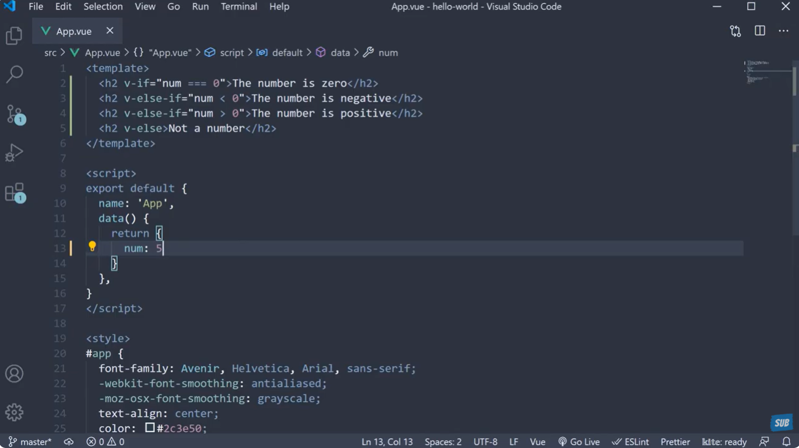

# Attributes in VUE JS

### `V-bind` Directive
- It is used to bind the html Attribute
- eg: Id and disabled dyamically bind with the HTML

```js
<script setup lang="js">
const isDisabled = true;
const id = "heading"
</script>

<template>
  <div>
    <button v-bind:disabled="isDisabled">Click me</button>
    <div v-bind:id="id">This is Ankush Paragraph</div>
  </div>
</template>

```

- **IMPORTANT** we can directly use the attributes like this
- `:id :disabled :class`, not need to write `v-bind`

```js
<script setup lang="js">
const isDisabled = false;
const id = "heading"
const id2 = "heading2"
</script>

<template>
  <div>
    <button :disabled="isDisabled">Click me</button>
    <div :id="id">This is Ankush Paragraph</div>

    <div :id="isDisabled ? id : id2">
      Dynamic Color change based on disabled
    </div>
  </div>
</template>


<style>
  #heading{
    color: red;
  }

  #heading2{
    color: green;
  }
</style>

```

- We can also bind the classes and inline style as well
- Best part we can bind it with array and object
- for inline Styling we use `:style ={}` style takes an object
- Inside the Style Object, user can directly enter the object name or key value pair
- For Array, we can enter multiple object inside an array

```javascript
  const dangerStyledObject = {
  color: 'red',
  border: '1px solid red',
  fontSize: '50px'
}

const h2Color = "blue"
const h2FontSize = "24px"


<template>
  <h1 :style="[dangerStyledObject]">Ankush</h1>

  <h2 :style={
    color: blue,
    fontSize: h2FontSize
  }>This is H2 Tag</h2>
</template>
```

# Conditional Rendering

- `v-if`
- `v-else`
- `v-else-if`
- `v-show`

### `v-if` `v-else`  `v-else-if`
- `v-if`  `v-else-if` both accept the numeric expression to evalute

- `v-else-if` should come in between of both

- `v-else-if` `v-else` must follow a `v-if` directive or a `v-else-if` directive to work

- `v-else` should exactly come in the next line of `v-if` otherwise it will not work

- Just like `<Fragment />` in react we have `<template>` in VUEJS




### `v-show`
- It is used to hide or show the element
- The Main Difference between `v-if` and `v-show` is:
  - when it is ` isVisible = false`, then `v-show` add
    - `style={display : none}`

- `V-If` mounts the element into the DOM, when condition is true and unmounts the element when condition is false
- `V-show` directive always remain in the DOM, only `Display CSS` property is used to toggle the visiblity

```javascript
const isVisible = true

<template>
  <div v-show="isVisible">Conditional Rendering Div</div>
</template>

```

# V-for

- Used for looping

- Normal use for `v-for`, 
### Looping an Array
```javascript

const names = ["Ankush", "Tanvi", "Rohit", "Yash"]

  <div v-for="value in names" :key="value">
    {{ value }}
  </div>

```

### Looping an Object
- We can have index as well
- we always bind the unique attribute

```javascript

const fullNames = [
  {
    firstName: "Ankush",
    lastName: "Thakur"
  },
  {
    firstName: "Tanvi",
    lastName: "Sharma"
  },
  {
    firstName: "Rohit",
    lastName: "Kumar"
  },
  {
    firstName: "Yash",
    lastName: "Singh"
  }
]

  <div v-for="(value, index) in fullNames" :key="index">{{value.firstName + " " + value.lastName}}</div>
```

###  Nested Looping

```javascript

const actor = [
  {
    name: "Shahrukh Khan",
    age: 57,
    movies: ["Dilwale Dulhaniya Le Jayenge", "My Name is Khan", "Chennai Express"]
  },
  {
    name: "Salman Khan",
    age: 56,
    movies: ["Bajrangi Bhaijaan", "Sultan", "Kick"]
  },
  {
    name: "Aamir Khan",
    age: 56,
    movies: ["Dangal", "3 Idiots", "PK"]
  },
  {
    name: "Hrithik Roshan",
    age: 48,
    movies: ["War", "Krrish", "Jodhaa Akbar"]
  }
]

  <div v-for="(value, index) in actor" :key="index"> {{ value.name }}
    <ul>
      <li v-for="(movie, index) in value.movies" :key="index">{{ movie }}</li>
    </ul>
  </div>
```


<!-- 982945667 = Ankush Thakur -->